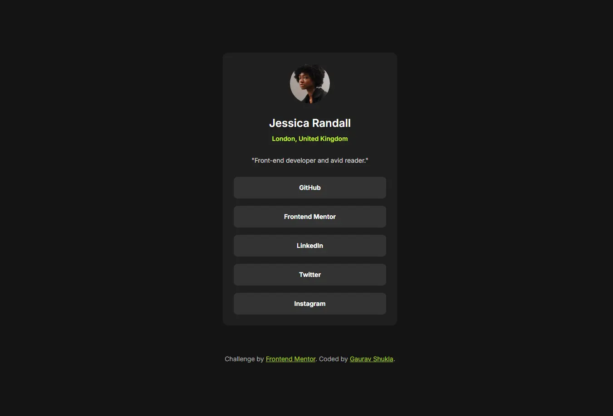

# Frontend Mentor - Social links profile solution

This is a solution to the [Social links profile challenge on Frontend Mentor](https://www.frontendmentor.io/challenges/social-links-profile-UG32l9m6dQ). Frontend Mentor challenges help you improve your coding skills by building realistic projects.

## Table of contents

- [Overview](#overview)
  - [The challenge](#the-challenge)
  - [Screenshot](#screenshot)
  - [Links](#links)
- [My process](#my-process)
  - [Built with](#built-with)
  - [What I learned](#what-i-learned)
  - [Useful resources](#useful-resources)
- [Author](#author)
- [Acknowledgments](#acknowledgments)

## Overview

### The challenge

Users should be able to:

- See hover and focus states for all interactive elements on the page

### Screenshot

### Links

- Solution URL: [Add solution URL here](https://your-solution-url.com)
- Live Site URL: [https://heygauravshukla.github.io/social-links-profile](https://heygauravshukla.github.io/social-links-profile)

## My process

### Built with

- Semantic HTML5 markup
- CSS custom properties
- CSS Grid
- Mobile-first workflow
- Self hosted fonts
- [Tailwind CSS](https://tailwindcss.com/) - A utility-first CSS framework

### What I learned

Using Tailwind CSS CDN to build websites even faster.

### Useful resources

- [google-webfonts-helper](https://gwfh.mranftl.com/fonts) - A Hassle-Free Way to Self-Host Google Fonts
- [Squoosh](https://squoosh.app) - Image Optimizer

## Author

- Website - [Gaurav Shukla](https://gshukla.vercel.app)
- Frontend Mentor - [@heygauravShukla](https://www.frontendmentor.io/profile/heygauravShukla)
- Twitter - [@heygauravShukla](https://www.twitter.com/heygauravShukla)

## Acknowledgments

Thanks to the Frontend Mentor for providing such rewarding challenges.
